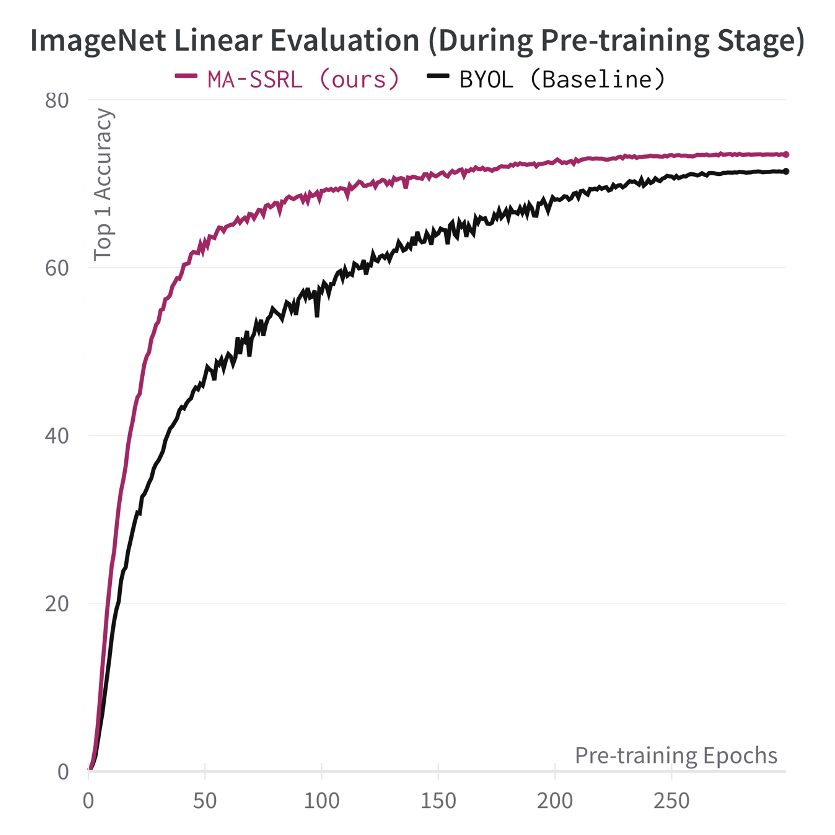
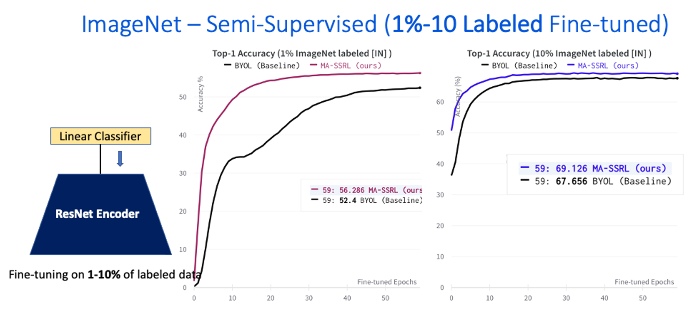

# Multi-Augmentation Self-Supervised Visual Representation Learning 

<p align="center">
  
</p>
<p align="center">
<font size=0.7> MASSRL Self-Supervised Pretraining Framework.</font> 
</p>

This repo is official Pytorch-Lightning implementation MASSRL.

[MASSRL Paper link](https://arxiv.org/abs/2205.11772)

[Blog Post]("Coming Soon")

```
MASSRL leverages the multi-Augmentation strategy to allow us to increase the quantity and diversity of data.
The result shows that requiring fewer epochs of iteration training can perform significantly better than the baseline
like (BYOL or SimCLR) for the self-supervised pre-training stage. 
```
<p align="center">
  
</p>

<font size="0.5"> *Figure: Comparsion effective of the learned representation during self-supervised pre-training stage between BYOL (Grill, Strub et al. 2020) & MA-SSRL (ours) use the same ResNet-50 backbone (IN) in Top-1 accuracy(%).*</font> 


This repo contains the source code for the `MASSRL`, our tool that makes the implementation of multi-Augmentation Strategies in Pytorch models effortless and less error-prone.

## Table of Contents

  - [Installation](#installation)
  - [Visualization `MASSRL` Multi-Augmentation Strategies ](#Different-Multi-Augmentation-properties)
  - [Configure Self-Supervised Pretraining](#Setup-self-supervised-pretraining)
    - [Dataset](#Natural-Image-Dataset)
    - [Hyperamters Setting](#Important-Hyperparameter-Setting)
    - [Choosing # augmentation Strategies](#Number-Augmentation-Strategies)
    - [Single or Multi GPUs](#Single-Multi-GPUS)
  - [Pretrained model](#model-weights)
  - [Downstream Tasks](#running-tests)
     - [Image Classification Tasks](#Natural-Image-Classification)
     - [Other Vision Tasks](#Object-Detection-Segmentation)
  - [Contributing](#contributing)


## Installation

```
pip or conda installs these dependents in your local machine
```
### Requirements
* torch
* torchvision
* tqdm
* einops
* wandb
* pytorch-lightning
* lightning-bolts
* torchmetrics
* scipy
* timm

## Visualization `MASSRL` Multi-Augmentation Strategies

<a target="[_parent](https://colab.research.google.com/drive/1fquGOr_psJfDXxOmdFVkfrbedGfi1t-X?usp=sharing)"></a>
Visualization Multi-Augmentation Strategies on Google-Colab Notebook: https://colab.research.google.com/drive/1fquGOr_psJfDXxOmdFVkfrbedGfi1t-X?usp=sharing 

Note the Visualization Augmentation *do not need to be trained* --- we are only Visualize Image after apply different Augmentation transformations.
However, you need to make sure that the `dataset` is appropriately passed down to the constructor of all submodules.
If you want to see this happen, please upvote [this Repo issue]

## Configure Self-Supervised `Pretraining` Stage

For pretraining the backbone, follow one of the many bash files in `bash_files/pretrain/`.

**NOTE:** Files try to be up-to-date and follow as closely as possible the recommended parameters of each paper, but check them before running.

### Dataset 
**Note:** Public ImageNet dataset is implement in this work, if you have your own dataset you can change the path corresponding. 

#### Downloading ImageNet-1K dataset (https://www.image-net.org/download.php).

#### Using your own dataset 

Consider dataset folder structure setup for Pytorch `ImageFolder` and `DataLoader`principle
#### Changing dataset path(your path) in pretraining Flags: 

`bash_files/pretrain/MASSL.sh`
    `
    --train_dir ILSVRC2012/train \
    --val_dir ILSVRC2012/val \
    `
### Hyperparameter Setting 
You can change 

### Number Augmentation Strategies Implementation
You can select the number of Augmentation you want by setting the Flags

### Training Single or Multiple GPUs
You can set how many GPUs for training by changing the Flags
We will Support distributed multi-nodes(machines) traning soon 

## Pre-trained model 

**Note:** Here is list of the pre-trained weight of the Residual Convolution Neural Nets (ResNets architectures). 
if Using different Neural Net archiectures you can consider modify the code in this module: 


### ImageNet 1K Self-supervised pre-training 

**Note:** hyperparameters may not be the best, we will be re-running the methods with lower performance eventually.

#### ImageNet 1K Linear Evaluation on Pre-trained model

**Note:** MLP Layer-Dim, and Batch_size are the configuration in Self-supervised pre-trained stage.

| Method       | Backbone | Epochs |  MLP Layer-Dim | batch_size |Acc@1 | Acc@5 | Checkpoint |
|--------------|:--------:|:------:|:----:|:--------------:|:--------------:|:----------:|:----------:|
| MASSRL  | ResNet50 |  300  |  2-512 | 2048 |  73.8    |  91.5    | [:link:](https://drive.google.com/file/d/17-_DkQjc8YKosXGPs19DOukcl-IAuzFO/view?usp=sharing) |
| MASSRL  | ResNet50 |  300  |  2-256 | 2048 |   73.46   |  91.3     | [:link:](https://drive.google.com/file/d/1woSkTArv1z10smrxf-3E9DrZbX6FOoQ4/view?usp=sharing) |
| BYOL    | ResNet50 |  100  | 2-512  | 4096 |     61.0   |  84.4      | [:link:](https://drive.google.com/file/d/14CbrNhIrhMf-TRHOBQ9Xfds1fWPsh5Qz/view?usp=sharing) |
| BYOL    | ResNet50 |  300  |  2-256 | 4096 |   72.8     |   91.0    | [:link:](https://drive.google.com/file/d/14BY5mSOo6rjDPyjJfBClUkBNURZsWY14/view?usp=sharing) |


#### Tips for pre-training 

- Use a large init learning rate {0.3, 0.4} for `short training epochs`. This would archieve better performance, which could be hidden by the initialization if the learning rate is too small.Use a small init learning rate for Longer training epochs should use value around 0.2.

- If your machine GPUs memory not >40G you can archieve large batch size by setting this Flags `--accumulate_grad_batches #` this number makes batch size will accumulate # times gradients in the forward path, then backward update the average gradients.

- if using your own datasets you can consider batch size and learning rate for your training.

## Downstream Tasks

### ImageNet 1K Semi-Supervised Evaluation on Pre-trained model

<p align="center">
  
</p>

<font size="0.5"> *Figure: Comparsion effective of the learned representation during self-supervised pre-training stage between BYOL (Grill, Strub et al. 2020) & MA-SSRL (ours) use the same ResNet-50 backbone (IN) in Top-1 & Top-5 accuracy(%).*</font> 

### Image Classfication Tasks
Update soon

### Other Vision Tasks (Object Detection - Segmentation)
Update soon

## Contributing

This project welcomes contributions and suggestions.  

